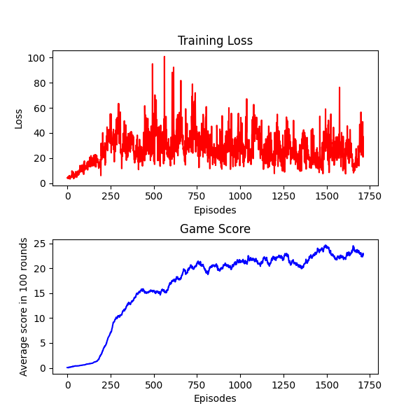
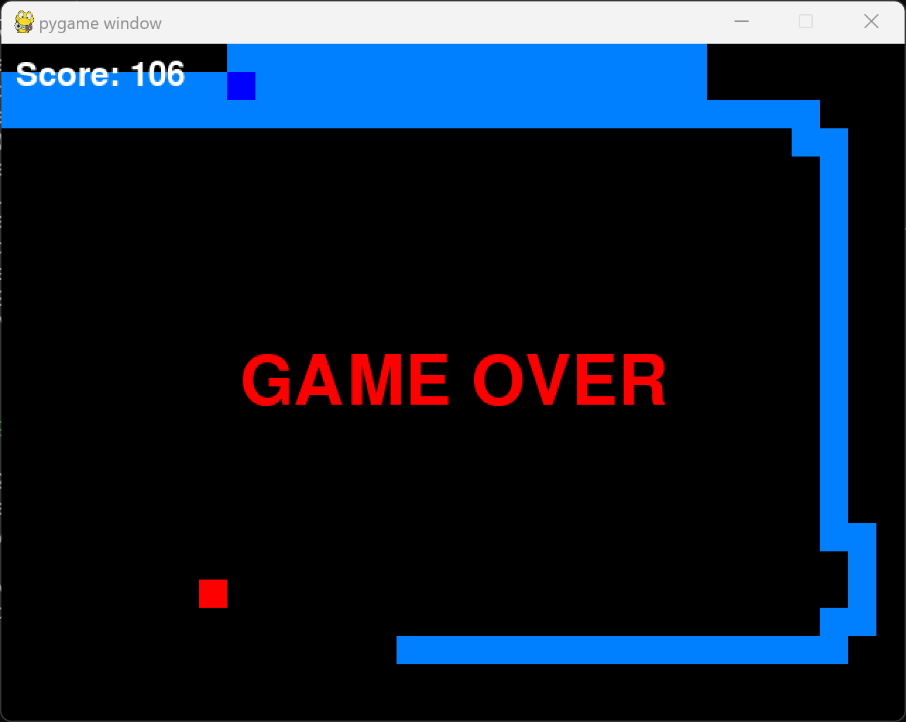

# SnakeRL

Using reinforcement learning to teach AI to play Snake

In a Snake game played on a 32x24 grid, the agent I trained over approximately 2000 episodes can achieve a score of around 70 points.

Packages requirement: pygame, torch, torchvision, matplotlib

## Known Issue

### Fatal Error on Window Resizing

The error message reads as follows:

Fatal Python error: PyEval_RestoreThread: the function must be called with the GIL held, after Python initialization and before Python finalization, but the GIL is released (the current Python thread state is NULL)

To avoid this error, please do not resize the figure window created by matplotlib.
