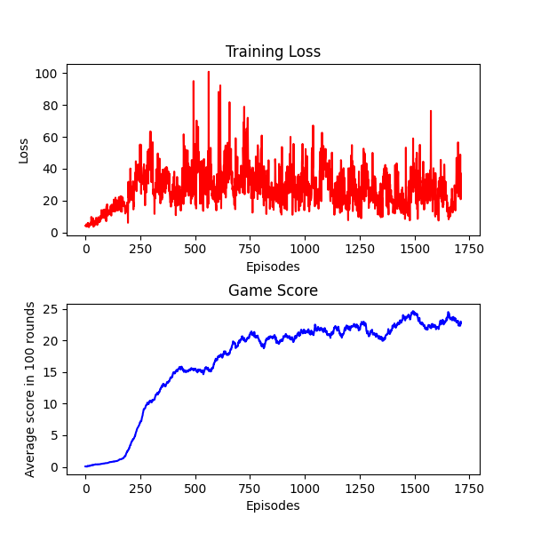
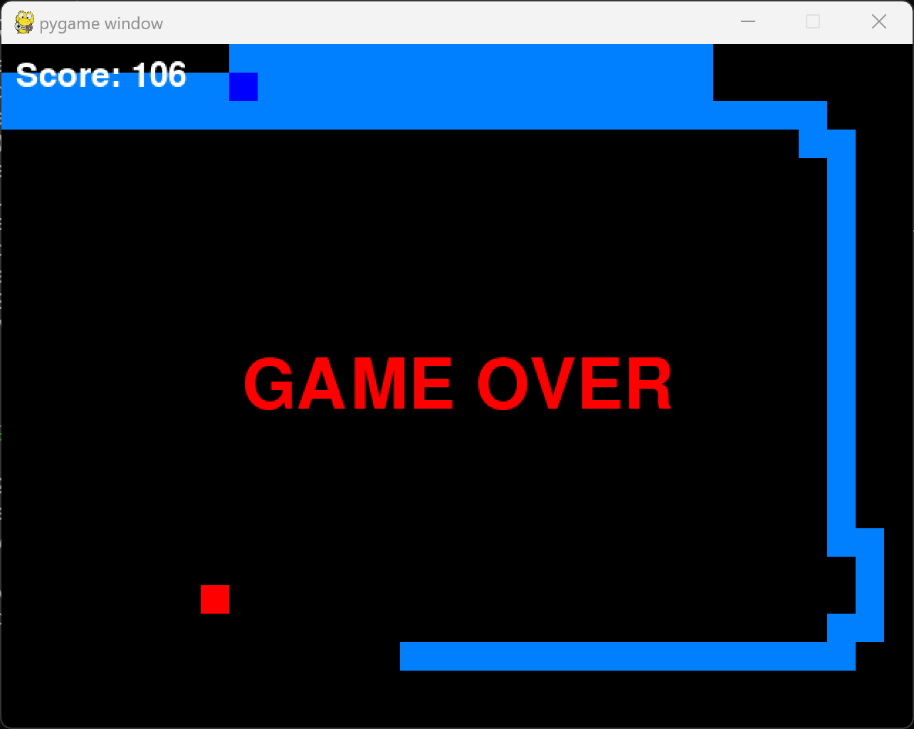

# SnakeRL

## Overview

Using DQN to teach AI to play Snake

In a Snake game played on a 32x24 grid, the agent I trained over approximately 2000 episodes can achieve a score of around 70 points.




## Dependencies:

pygame, torch, torchvision, matplotlib

## Getting Started:

1. Clone the repo or download it.
2. To change hyperparameters or settings, visit `common\settings.py`.
3. The reward function is in `agent\play_game_with_agent.py`.
4. Feel free to walk around and change other codes.
5. Run `python main.py` in terminal window and train your own snake!

## File Structure:

```
.
├── agent/
│ ├── base_agent.py # The base agent class
│ ├── dqn_agent.py # The agent using DQN for learning
│ └── greedy_agent.py # A simple agent that runs directly towards food
│
├── common/
│ ├── settings.py # Hyperparameters, game size, and game speed
│ └── utils.py # Helper functions
│
├── game/
│ ├── game_display.py # Game display
│ ├── game_logic.py # Game logic
│ ├── main_game.py # Integrates game_display and game_logic
│ └── states.py # Game state and corresponding state tensor
│
├── model/
│ ├── weights/
│ │ └── linear_dqn_model.pth # Model weights
│ └── dqn_model.py # Neural network used by DQNagent
│
├── pngs/ # Image folder
│
└── main.py # Main program, primarily contains user interaction
```

## Some problems you might what to ask

1.  How do you represent the state and actions?

    Actions:

    Actions are represented by the Action enum, which includes three possible moves:

    - TURN_RIGHT (0)
    - GO_STRAIGHT (1)
    - TURN_LEFT (2)

    State Representation:

    In the game:
    The state is represented as a matrix.

    For the agent:
    The state is represented as a tensor with shape (15,), including:

    - [0:2] Direction (x and y components)
    - [2:4] Relative food position
    - [4:5] Snake length
    - [5:6] Steps of doing nothing (the agent would lose if this value is too big)
    - [6:15] Danger distances in three directions (right, straight, left) for each possible next move

2.  Why not use CNN and just represent the state with a matrix?

    At first I tried to represent the state with a tensor whose shape is (channels, grid_width, grid_height) and use CNN as the model, but the agent seems to learn nothing. Probably the reason is that there are too many states for the agent.

3.  Any other resources about teaching AI to play Snake?

    - [Video Tutorial](https://github.com/patrickloeber/snake-ai-pytorch)

    - [Comparing Different Setups for Reinforcement Learning in Snake](https://davidd-55.github.io/sNNake/)

    - [Written Guide: Genetic Algorithm Approach](https://craighaber.github.io/AI-for-Snake-Game/website_files/index.html)

    - [Another Genetic Algorithm Approach](https://github.com/arthurdjn/snake-reinforcement-learning)

## Known Issues

### Fatal Error on Window Resizing

The error message reads as follows:

Fatal Python error: PyEval_RestoreThread: the function must be called with the GIL held, after Python initialization and before Python finalization, but the GIL is released (the current Python thread state is NULL)

To avoid this error, please do not resize the figure window created by matplotlib.

## License

This project is licensed under the MIT License - see the [LICENSE](LICENSE) file for details.
