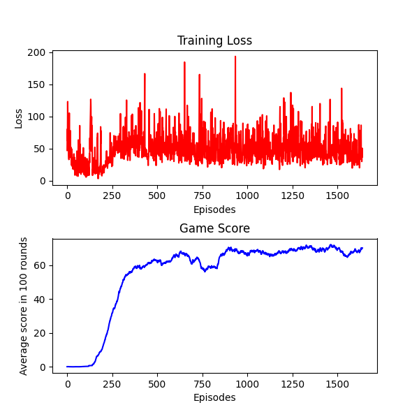
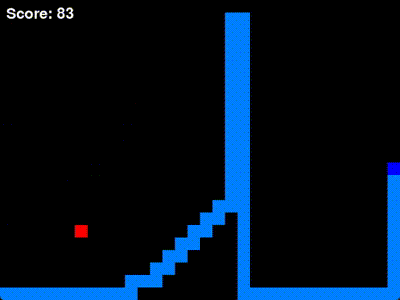

# SnakeDRL

## Overview

Using DQN to teach AI to play Snake

In a Snake game played on a 32x24 grid, the agent I trained approximately 2000 episodes can achieve a score of around 80 points. And in a snake game played on a 5x5 grid, the agent can sometimes beat the game!




## Dependencies:

pygame, torch, torchvision, matplotlib

## Getting Started:

1. Open a terminal.

2. Download python and required packages.

   `pip install pygame==2.6.0 torch==2.3.0 torchvision==0.18.0 matplotlib==3.9.2 numpy==1.26.4`

   If you use conda, you can firstly use `conda install pip`, then use `pip install pygame==2.6.0 torch==2.3.0 torchvision==0.18.0 matplotlib==3.9.2 numpy==1.26.4`

3. Clone the repo or download it.

   `git clone https://github.com/rinevard/SnakeDRL.git`

4. Navigate to the project directory.

   `cd SnakeDRL/`

5. Run `python main.py` in terminal window and train your own snake!

6. (Optional) Visit `common\settings.py` to change hyperparameters and other settings.

7. (Optional) Visit `agent\play_game_with_agent.py` to change the reward function.

8. (Optional) Walk around and change other codes.

Note: You can also run `main.ipynb` on [Google Colab](https://colab.research.google.com). However, some features like dynamic plot updates and game display may not be available in this environment. The core functionality of training the snake AI will still work.

## File Structure:

```
.
├── agent/
│ ├── base_agent.py # The base agent class
│ ├── mlp_agent.py # The agent using MLP and DQN
│ ├── cnn_agent.py # The agent using CNN and DQN
│ ├── greedy_agent.py # A simple agent that runs directly towards food
│ └── play_game_with_agent.py # Reward func, play func, play and learn func
│
├── common/
│ ├── settings.py # Hyperparameters, game size, and game speed
│ └── utils.py # Helper functions
│
├── game/
│ ├── game_display.py # Game display
│ ├── game_logic.py # Game logic
│ ├── main_game.py # Integrates game_display and game_logic
│ └── states.py # Game state
│
├── model/
│ ├── weights/
│ │ └── mlp_model.pth # Model weights
│ │ └── cnn_model.pth # Model weights
│ └── dqn_model.py # Neural networks
│
├── pngs_and_gifs/ # Image folder
│
├── main.ipynb # Main program in colab or jupyter notebook.
│
└── main.py # Main program, primarily contains user interaction
```

## Some problems you might what to ask

1.  How do you represent the state and actions?

    Actions:

    Actions are represented by the Action enum, which includes three possible moves:

    - TURN_RIGHT (0)
    - GO_STRAIGHT (1)
    - TURN_LEFT (2)

    State Representation:

    In the game:
    The state is represented as a matrix.

    For the agent:
    The state is represented as a tensor with shape (15,), including:

    - [0:2] Direction (x and y components)
    - [2:4] Relative food position
    - [4:5] Snake length
    - [5:6] Steps of doing nothing (the agent would lose if this value is too big)
    - [6:15] Danger distances in three directions (right, straight, left) for each possible next move

2.  Why not use CNN and represent the state with a matrix?

    At first I tried to represent the state with a tensor whose shape is (channels, grid_width, grid_height) and use CNN as the model, but the agent seems to learn nothing. Probably the reason is that there are too many states for the agent.

    Update (2024.9.2)
    I tried training a CNN-based agent again and found that it is feasible. I trained a CNN-based agent on a 10x10 grid, and after about 1500 episodes of training, it could score around 30 points (averaged over 100 simulation rounds). In comparison, after about 1500 episodes of training, the MLP-based agent could score around 30 points as well. Furthermore, the CNN-based agent produced greater variance in scores compared to the MLP-based agent. The CNN-based agent sometimes kept circling around the food and did nothing. I guess that's because its tensor representation of state doesn't include 'time' (for the MLP-agent, 'time' is represented as 'steps_of_do_nothing').

    However, the training speed was significantly slower than training an MLP-based agent. I was using a laptop with integrated graphics, and I trained the MLP agent on the local CPU. Training a CNN-based agent on the CPU was too slow, so I trained the CNN-based agent on GPU using Google Colab.

3.  Any other resources about teaching AI to play Snake?

    - [Video Tutorial](https://github.com/patrickloeber/snake-ai-pytorch)

    - [Comparing Different Setups for Reinforcement Learning in Snake](https://davidd-55.github.io/sNNake/)

    - [Written Guide: Genetic Algorithm Approach](https://craighaber.github.io/AI-for-Snake-Game/website_files/index.html)

    - [Another Genetic Algorithm Approach](https://github.com/arthurdjn/snake-reinforcement-learning)

## Known Issues

### Fatal Error on Window Resizing

The error message reads as follows:

Fatal Python error: PyEval_RestoreThread: the function must be called with the GIL held, after Python initialization and before Python finalization, but the GIL is released (the current Python thread state is NULL)

To avoid this error, please do not resize the figure window created by matplotlib.

## License

This project is licensed under the MIT License - see the [LICENSE](LICENSE) file for details.
